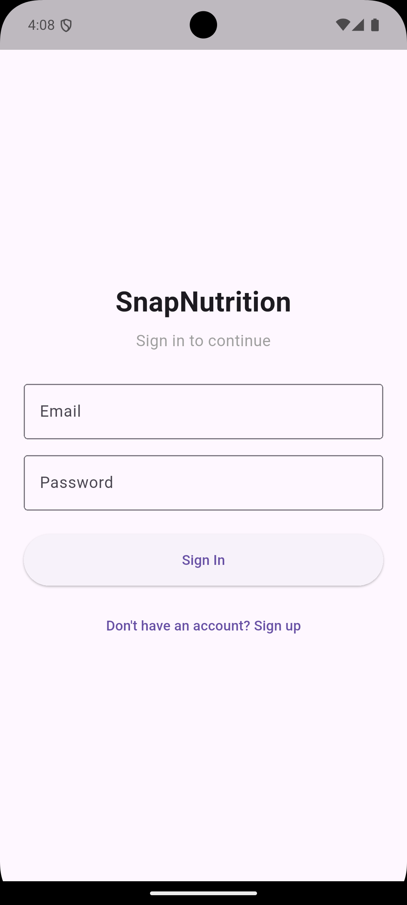
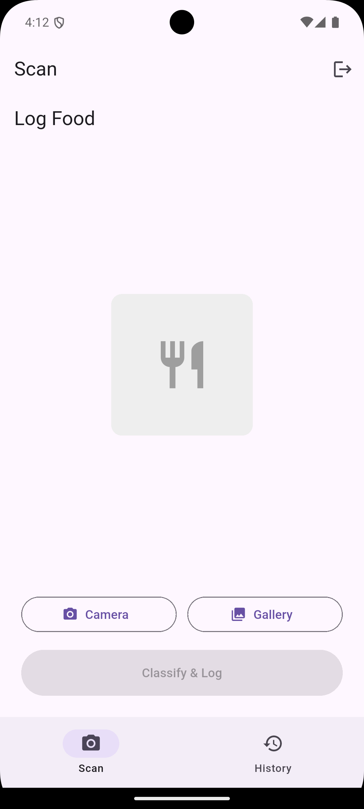
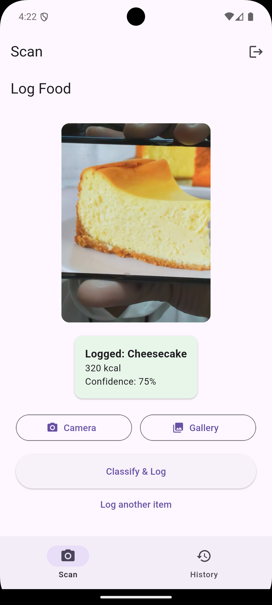
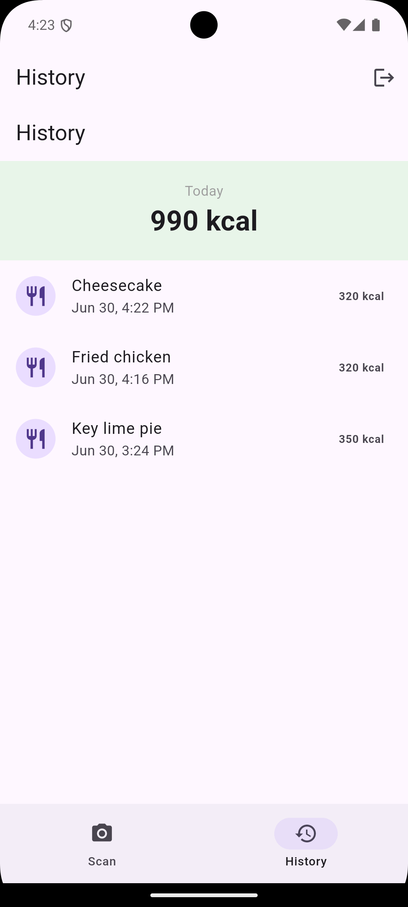

# SnapNutrition 🍽️

An AI-powered food recognition and nutrition tracking app built with Flutter. Snap a photo of your food, and SnapNutrition uses an on-device machine learning model to identify what you're eating and log it to the cloud — no internet round-trip required for classification.
## 📱 Screenshots

| Login | Scan | Classification Result | History |
|---|---|---|---|
|  |  |  |  |
## ✨ Features

- 📸 **Photo-based food logging** — capture or pick a photo and get an instant classification
- 🧠 **On-device ML inference** — uses a TensorFlow Lite model (MobileNet-based, 2000+ food categories) running entirely on the device, no API calls needed for classification
- 🔐 **Firebase Authentication** — secure email/password sign-up and login
- ☁️ **Cloud sync** — food entries are saved to Cloud Firestore, scoped per user
- 📊 **History & daily totals** — view past entries and today's calorie total
- 🏗️ **Clean MVVM architecture** — strict separation between Views, ViewModels, Repositories, and Services

## 🛠️ Tech Stack

| Layer | Technology |
|---|---|
| Framework | Flutter / Dart |
| State Management | Provider (ChangeNotifier) |
| Authentication | Firebase Auth |
| Database | Cloud Firestore |
| ML Inference | TensorFlow Lite (on-device) |
| Image Handling | image_picker, image |

## 🏗️ Architecture

This project follows a strict **MVVM (Model-View-ViewModel)** pattern:

```
lib/
├── models/          → Plain data classes (FoodEntry)
├── services/        → Thin wrappers around SDKs (Firebase, TFLite) — no business logic
├── repositories/     → Business logic, combines services into a clean domain API
├── viewmodels/       → ChangeNotifier classes holding UI state
└── views/            → Dumb widgets that watch ViewModels and render their state
```

Each layer only talks to the layer directly below it — Views never touch Firebase or TFLite directly, and ViewModels never import Firebase packages. This keeps the codebase testable and easy to extend.

## 🔒 Security

Firestore access is locked down with security rules ensuring users can only read/write their own data:

```
match /users/{userId}/{document=**} {
  allow read, write: if request.auth != null && request.auth.uid == userId;
}
```

## 🚀 Getting Started

### Prerequisites
- Flutter SDK (3.x+)
- A Firebase project with Authentication (Email/Password) and Firestore enabled

### Setup
```bash
git clone https://github.com/NOTsaptaswa/snap-nutrition.git
cd snap-nutrition
flutter pub get
```

You'll need to connect your own Firebase project:
```bash
dart pub global activate flutterfire_cli
flutterfire configure
```

Then run:
```bash
flutter run
```

## 📦 The ML Model

This app uses Google's [AIY food classification model](https://www.kaggle.com/models/google/aiy/tfLite/vision-classifier-food-v1) (MobileNet V1-based), trained on a wide range of food categories. It's bundled as a `.tflite` file and runs entirely on-device — no internet connection or external API needed for image classification.

## 🗺️ Roadmap

- [ ] Offline-first caching with Hive (queue entries when offline, sync when reconnected)
- [ ] Live camera preview with real-time classification overlay
- [ ] Nutrition charts and weekly trends (fl_chart)
- [ ] Larger/customizable nutrition lookup database
- [ ] Cloud image storage for synced food photos

## 📄 License

This project is for educational/portfolio purposes.
